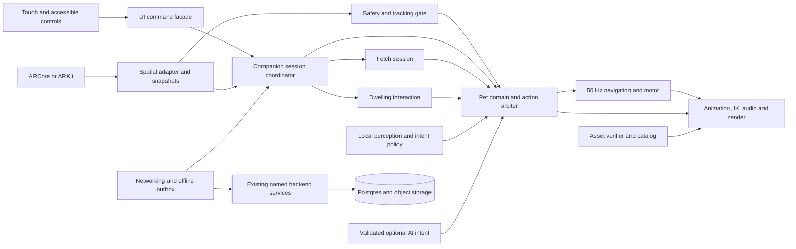

# GW-ARCH-003 — AI GibiPet, Dwelling, and AR Fetch

| Document control | Value |
|---|---|
| Version | 1.0.0 |
| Date | 2026-09-05 |
| Role | Lead Software Engineer architecture and implementation handoff |
| Status | Proposed implementation baseline; specifications authored, runtime changes not implemented by this package |
| Source reviewed | `73b36c758aaef98f23c206729fd31466a8cba190` on `main` |
| Repository | [robs46859-eng/gibiworld](https://github.com/robs46859-eng/gibiworld) |
| Scope | One AI companion, one functional dwelling, and player-controlled solo AR fetch on Android and iOS |
| Change record | [ADR-013](adr/ADR-013-ar-companion-completion-baseline.md) |

## 1. Engineering decision

Complete the existing Unity application around a **player-driven, locally simulated companion loop**. The player places a correctly sized pet and dwelling in a measured play area, throws a virtual toy, watches the pet retrieve and return it, praises or pets the companion, and can send it home to rest. The pet also makes contextual choices when the player is idle. All movement, throw trajectories, toy ownership, and action completion remain locally controlled. A language model can suggest an approved intent but cannot operate the pet's body or delay a player action.

This is a long-lived product implemented with a small set of explicit modules. Preserve the existing assembly boundaries, providers, asset authority, and fixed tick rates. Expand tested components rather than replacing the project with a new framework.

### Specification package

| Read order | Document | Engineering deliverable |
|---|---|---|
| 1 | This document | Product behavior, verified baseline, architecture, ownership, decisions |
| 2 | [Runtime and mechanics](specs/ar-companion/01-runtime-and-mechanics.md) | Spatial model, pet brain, fetch and dwelling state machines, input, interruption contracts |
| 3 | [Assets and animation](specs/ar-companion/02-assets-and-animation.md) | Asset bill of materials, dimensions, rig, clips, sockets, materials, publishing and quality gates |
| 4 | [Services and persistence](specs/ar-companion/03-services-and-persistence.md) | Auth, entitlement, APIs, data model, synchronization, model inference boundary, operations |
| 5 | [Delivery and acceptance](specs/ar-companion/04-delivery-and-acceptance.md) | File-level backlog, dependencies, test matrix, milestones, release gates |
| 6 | [Tuning example](specs/ar-companion/examples/companion-tuning.v1.json) | Machine-readable starting values, to become validated authored configuration during implementation |

**Normative terms:** SHALL/MUST describe requirements for the target implementation. A requirement is not evidence of implementation. Numeric values labelled *initial tuning* are starting design values that need device and asset validation; inherited limits remain binding.

GW-ARCH-001 remains the product, security, and governance baseline. GW-ARCH-002 and accepted ADR-008/011/012 retain their implementation authority until ADR-013 and this version are adopted. Specific conflicts and proposed resolutions are explicit below. The annexes form part of version 1.0.0; examples do not silently amend runtime contracts.

## 2. Definition of the complete experience

### First session

1. Authenticate and select an entitled, verified pet. Request camera permission when entering AR. Explain the camera use in one sentence; no microphone permission is needed for core play.
2. Scan a clear horizontal surface. Show a placement outline for the **whole composition**, including the dwelling, pet starting position, and an outbound/return corridor. An accepted center point alone is insufficient.
3. Rotate the preview, confirm placement, and create one local anchor. Preserve the pet's physical scale. Do not resize it to hide inadequate space.
4. The pet looks toward the player and greets. The dwelling is usable and remains visibly grounded. Controls appear: **Fetch**, **Come**, **Sit**, **Home**, **Pet**, and **Pause**.
5. Select Fetch, aim at an accepted target, and release a drag to throw. A tap-target plus Throw button provides the same interaction without a timed gesture.
6. The toy follows a bounded arc. The pet watches, approaches after landing, aligns its mouth, picks it up, returns to the player's valid return zone, and visibly drops it.
7. The player can praise or repeat immediately. Repetition has no compulsory rest, penalty, currency charge, or visible repetition counter.
8. Home causes the pet to walk through a correctly sized doorway, turn inside, lie down, and rest. Come or Fetch wakes it and brings it out through the doorway.

### Return session

Restore pet identity, selected dwelling style, approved preferences, and durable progression. Ask the player to place the composition again for a local session. Saving a dwelling selection is not saving a real-world room anchor. A processed VPS site is required for a later persistent spatial placement feature under GW-ARCH-001.

### Completion levels

| Level | Required outcome |
|---|---|
| Interactive vertical slice | Real player throw, native retrieve/carry/drop, usable dwelling, tracking-loss recovery on the reference Android device |
| Complete companion release | Production asset trust and entitlement, durable identity/preferences, both platform providers, accessibility, offline continuation, full acceptance matrix |
| Model-enhanced companion | Validated local intent-source integration, measured model/device budgets and quality improvement, no regression to the complete companion experience |

The base AI pet includes perception, stable personality, action selection, memory use, gaze, locomotion, and responses to the user. It is not merely an animation playlist. Free-form conversation, voice chat, autonomous room exploration, shared fetch, ranked scoring, and multi-pet behavior are outside this requested release. Preserve their future interfaces without implementing their infrastructure in the critical path.

## 3. Evidence-backed starting point

Repository files were inspected on 2026-09-05. Unity, Blender, mobile builds, and devices were **not run** for this architectural deliverable. Earlier test results below are historical reports.

| Area | Observed source or recorded evidence | Completion work |
|---|---|---|
| Engine | Unity `6000.0.74f1`; AR Foundation/ARCore/ARKit `6.4.2`; URP `17.0.4`; glTFast `6.16.1`; Addressables `1.22.3`; Animation Rigging `1.3.0`; Input System `1.11.2` | Preserve lockfile; validate clean restore and both platforms |
| Android provider | ADR-012 selects direct ARCore for P0; NSDK `4.1.0-26051913` stays pinned but inactive | Keep direct provider until a separately validated migration |
| Placement | `ARSurfaceProbe` uses `PlaneWithinPolygon`; `ARWorldAnchorHost` anchors a composition; source and handoff include camera pose-driver repair | Validate full footprint and path geometry; genuine quality measurements |
| Spatial quality gaps | `ARSurfaceProbe` supplies constant light confidence and headroom; radius uses plane extents, not distance from hit to polygon edge | Replace placeholders with measured/unknown states and boundary-distance checks |
| Pet behavior | `IntentPolicy`, `BehaviorArbiter`, `LocalFirstBehavior`, `PetBiometrics`, `PetController` exist | Complete each enabled intent's executor, isolate state ownership, expose player commands |
| Fetch | `FetchSequence` has outbound/pickup/return/drop; `FetchToy` has attach/drop/reset; `SandboxDemoDirector` triggers repeated fetch/rest | Player aiming/throw, flight/landing, movement-aware return, cancellation tokens, collision-aware path |
| Animation | `PetAssetLoader` imports Legacy animation; `PetAnimator` crossfades; per-pet profile substitutes missing clips | Generic Animator/Playables with rigging; native clips and contact timing |
| Dwelling | `RestAffordance` documents 0.294 × 0.446 m opening versus 0.54 × 0.74 m reference dog envelope | New fitted dwelling geometry and continuous entry/exit; do not conceal a clipping pet |
| Asset scale | Later inventory records 0.50 m pet shoulder and 0.067 m ball; profile carries grounding/orientation corrections | Measure fresh final assets and signed profiles; preserve originals |
| Backend | OpenAPI and three migrations exist; current tree has no implemented `services/` or `infra/` directory | Implement auth, state, asset and sync services; deployment remains unverified |
| AI policy divergence | GW-ARCH-002 §7 describes local LLM; `ai-intent.schema.json` describes architecture B with no current model producer | ADR-013 explicitly sequences the complete deterministic pet and a separately gated model supplement |
| Historical device result | August 4 `HANDOFF.md` reports 340/340 EditMode, 2/2 PlayMode, and a Pixel 9a placement/fetch/rest pass | Establish fresh results from the implementation commit; do not reuse as release proof |

The August 2 `BUILD_STATE.md`, `BUILD_GATES.md`, and `ASSET_PRODUCTION.md` contain entries superseded by later source and the August 4 handoff. They are historical inputs, not the status authority for this work. The complete source inventory includes assets outside the sparse local checkout; absence from disk is not evidence of absence from Git.

## 4. Architecture

Diagram arrows show data flow, not permission to reference another assembly. The existing checked assembly graph remains authoritative. In particular, Gameplay requests pet creation through Pets, not by directly accessing AssetRuntime; Pets receives spatial query interfaces/value snapshots defined in Core and implemented in Spatial.

### Seven responsibility groups

| Group | Existing assemblies | Responsibility and ownership |
|---|---|---|
| Foundation | `Gibi.Core` | IDs, clocks, value types, command/result records, domain-facing ports; no provider dependency |
| Spatial | `Gibi.Spatial` | Provider lifecycle, planes, anchor-local conversion, accepted surfaces, quality and hazard snapshots |
| Pet | `Gibi.Pets` | Entity state, perception, arbiter, movement intent, animation facade, affordance execution |
| Play session | `Gibi.Gameplay` | Placement orchestration, player commands, fetch rounds, dwelling layout, session interruption |
| Content | `Gibi.AssetRuntime` | Verified manifests, bounded import, cache, trusted material policy, content compatibility |
| Connected features | `Gibi.Networking`, `Gibi.AI`, `Gibi.Telemetry` | Generated clients, outbox, optional intent source, privacy-filtered nonblocking diagnostics |
| Presentation and tooling | `Gibi.UI`, `Gibi.Editor`, test assemblies | Controls, onboarding, authored config, scene generation, validators, build gates |

Do not introduce ECS, a general behavior-tree editor, a service mesh, or a mandatory realtime server for one pet. Extract narrowly named classes from `PetController` as their responsibilities become separately testable. Preserve its public facade while migrating callers.

### Runtime state ownership

| State | Sole writer | Lifetime |
|---|---|---|
| Selected pet and confirmed bond/preferences | Game service; local read model | Durable, revisioned |
| AR tracking and observed geometry | Spatial adapter | Session only |
| Anchor-local pet pose and velocity | `PetMotor` at 50 Hz | Session only |
| Active action and action token | `BehaviorArbiter` / action executor | Session only |
| Fetch phase and round sequence | `FetchSession` | One local round |
| Toy pose and owner | `ToyController`, using flight/mouth/ground mode | Session only |
| Dwelling occupancy/reservation | `DwellingInteraction` | Session only |
| Animation graph and sockets | Pet presentation | Instance lifetime |
| Authored limits, clip bindings, profiles | Validated ScriptableObjects or signed catalog metadata | Immutable during an action |
| Offline pending events | Durable local outbox | Until acknowledged or expired |

Direct references are appropriate inside one composed feature. Use Core ports across a boundary; emit typed events for UI/telemetry. Do not use a global event bus to issue gameplay commands. Subscriptions must be released on scene unload and pet switch.

## 5. Bootstrap and scene contract

Keep code-generated `Bootstrap`, `ARWorld`, and `PetSandbox`. `GibiBootstrap` owns a documented asynchronous initialization sequence; other components expose initialization rather than depending on accidental Awake order.

1. Load build manifest, config defaults, secure credential storage, and local save migrations.
2. Install telemetry with privacy filtering; authenticate and obtain catalog/entitlement/config snapshot.
3. Construct safety and lifecycle gates before enabling interaction or requesting AR.
4. Load ARWorld additively; validate exactly one ARSession, one XROrigin, one tracked-pose driver, one active platform loader, and one AudioListener across loaded scenes.
5. Observe provider availability; scan and validate a play area while verifying selected content asynchronously.
6. Create anchor; instantiate all content hidden; validate profile, skeleton, path and entry envelope; reveal atomically when ready.
7. Enable user controls. The production scene SHALL have the automated demo director disabled.
8. On unload, cancel tasks, invalidate action/anchor revisions, clear input, dispose animation/import resources, detach held toy, release reservations and content handles, and remove anchors.

Every asynchronous completion carries session ID and generation. A completion from an old scene or pet must release its resources without modifying the new session. No startup error leaves an invisible live pet or an input-enabled half-built composition.

## 6. Decisions that prevent rework

| Decision | Rationale and consequence |
|---|---|
| Phone/tablet AR with touch as the primary input | Matches existing client; no headset or XRI package dependency for a touchscreen throw |
| One anchor for the compact composition | Pet, ball, home and path share a frame; no per-ball or per-paw anchors |
| Local room placement is session-only | Persist identity/config, never an AR session transform; re-place after relaunch |
| Kinematic, fixed-step toy flight | Consistent preview and landing without depending on cross-device PhysX determinism |
| Path-constrained pet movement | House walls, unsafe cells and observed obstacles affect motion; visual occlusion alone is not collision |
| Trusted action timing | Gameplay progresses without animation visibility or imported animation events |
| Real dwelling interior | The dog physically traverses a fitted opening; no hidden-renderer substitute for entry |
| Kind local AI baseline | Personality, attention and variety work without a model; fatigue changes pace, not permission to play |
| Catalog revision 2 initially | No new remote intent enum needed: use existing RETRIEVE/REST/SETTLE and existing validated modifiers |
| Runtime model is a gated enhancement | Keep GW-ARCH-002's future port but benchmark an actual artifact/backend before promising GPU/NPU support |
| Full spatial metrics or explicit degradation | Unknown is not a safe numeric constant; device tiers expose actual capability |
| Server owns durable value | Local fetch is unranked; clients cannot grant currency, paid items, or arbitrary bond increments |

## 7. Performance and capability budget

Inherited from GW-ARCH-001: Tier A/B target 60 fps with p95 CPU and GPU each ≤16.7 ms; Tier C 30 fps and p95 ≤33.3 ms. Peak resident memory ≤1.2 GiB A/B and ≤900 MiB C. Draw calls ≤160 A/B and ≤100 C. Validate at least a ten-minute representative session; add a twenty-minute thermal soak.

Initial subsystem allocations: behavior ≤0.5 ms per 10 Hz tick; navigation plus toy simulation ≤1.0 ms per fixed tick; no steady-state managed allocation inside those loops. A new path job should complete within 100 ms on the reference device; hold or reuse the last safe path while work is pending. Measure AR provider and animation costs together with these systems.

Tier C removes optional model inference, advanced fur, expensive shadows and nonessential effects first. It retains the same commands, action order, dimensions, and response semantics. Depth is enabled only where supported; absence never becomes a fabricated collision measurement. A device without sufficient spatial evidence offers a companion view or an explicitly gated constrained practice mode as detailed in the runtime annex.

## 8. Delivery boundary and unresolved decisions

The requested deliverable is this architecture package. It does not assert that production services exist, that final assets are authored, that a language model runs on the device, or that a build passed today.

Engineering can start with the selected defaults: reference dog, 0.067 m ball, a new dog-sized dwelling, solo unranked play, Android first followed by iOS parity. Remaining decisions have owners and deadlines in the delivery annex. They concern release eligibility and optional features, and do not prevent implementation of the core loop.

## 9. Sources and verification notes

Repository anchors: [original specification](../GibiWorld_Architecture_Specification.pdf), [coding specification](GW-ARCH-002-Coding-Specification.md), [August 4 handoff](../HANDOFF.md), [package manifest](../clients/gw-mobile/Packages/manifest.json), [fetch sequence](../clients/gw-mobile/Assets/Gibi/Pets/Runtime/FetchSequence.cs), [demo director](../clients/gw-mobile/Assets/Gibi/Pets/Runtime/SandboxDemoDirector.cs), [rest affordance](../clients/gw-mobile/Assets/Gibi/Pets/Runtime/RestAffordance.cs), [intent schema](../contracts/schemas/ai-intent.schema.json), and [connectivity policy](../clients/gw-mobile/Assets/Gibi/AssetRuntime/Runtime/ConnectivityPolicy.cs).

External documentation checked 2026-09-05:

- Unity documents anchor parenting and cautions against many nearby anchors; the single-composition anchor is this design's application of that guidance. [AR Foundation anchor introduction](https://docs.unity3d.com/Packages/com.unity.xr.arfoundation@6.4/manual/features/anchors/introduction.html).
- ARCore depth is a device capability that must be enabled; feature presence cannot be inferred from ARCore availability alone. [Google ARCore Depth](https://developers.google.com/ar/develop/depth).
- Niantic publishes Unity setup and AR Foundation compatibility guidance. Preserve this project's pinned versions and ADR-012 instead of treating current documentation as authorization to upgrade. [Niantic SDK setup](https://www.nianticspatial.com/docs/ardk/setup/).
- Unity AI Navigation can build surfaces from selected geometry. This package selects a bounded local grid for the small floor game; a later NavMesh adapter is an alternative subject to dependency and device validation. [NavMesh Surface reference](https://docs.unity3d.com/Packages/com.unity.ai.navigation@2.0/manual/NavMeshSurface.html).

Online package documentation may show a later patch than the repository pin. API signatures must be checked against the installed pinned package during implementation.
