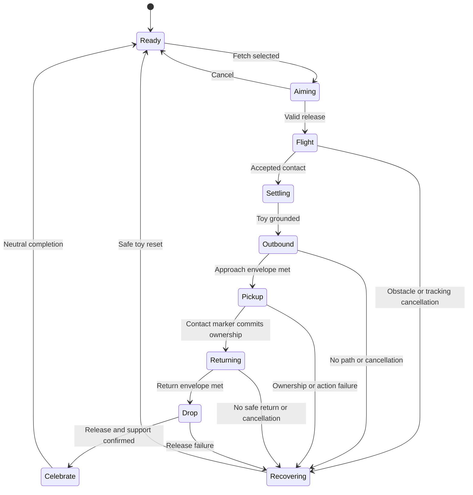

# Runtime and mechanics — GW-ARCH-003 v1.0.0

Parent: [architecture](../../GW-ARCH-003-AR-Companion-Build-Specification.md). All classes marked *new* are proposed work; the source review did not find them implemented.

## 1. Session and coordinate model

Use meters, +Y up, gameplay forward +Z. Imported glTF axis conversion happens once in the trusted asset/profile boundary. Pet motion, toy simulation, paths, dwelling markers, and return targets use the same anchor-local frame.

```text
ARWorld
  ARSession
  XROrigin
    ARCamera [tracked pose driver, camera/background/occlusion managers]
  SessionAnchor [provider-owned transform]
    PlacedWorldRoot [identity scale]
      PetRoot [motor-owned pose]
        PetAssetRoot [verified model + versioned import correction]
        InteractionVolumes
      DwellingRoot [catalog-authored pose]
        ExteriorApproach / DoorThreshold / InteriorRest / InteriorTurn / ExitClear
      ToyRoot [ToyController-owned pose]
      PlayAreaOverlay
```

Only the provider changes SessionAnchor. Nothing writes camera tracking transforms. PetRoot scale remains one; physical size is baked into the published model/profile. World-space query results are converted to anchor-local once when building an immutable spatial snapshot.

Every snapshot has `sessionGeneration`, `anchorRevision`, `geometryRevision`, `observedAtTick`, quality states, accepted polygon, exclusions, and sampled heights. Every command, path, throw, and asynchronous callback records the relevant revisions. Stale results cannot overwrite a later placement.

### Session states

| State | Entry / work | Exit |
|---|---|---|
| Booting | Initialize services and local read model | AuthReady or RecoverableError |
| AuthReady | Validate account, entitlement, manifest and content | ScanRequested |
| Scanning | Observe planes, light, obstacles and sufficient area | PreviewReady |
| PreviewReady | Player rotates/positions full footprint; continuously validate | PlaceConfirmed or Scanning |
| Placing | Create anchor and bind verified content; interaction disabled | Active or PreviewReady on atomic rollback |
| Active | Allow approved commands | Suspended, Repositioning, Ending |
| Suspended | Freeze movement, hold action state; show reason | Active after revalidation, or Repositioning |
| Repositioning | Cancel active round, release occupancy, recreate anchor | Active after explicit placement |
| Ending | Cancel work and save non-spatial state | CompanionView |

An unsupported device or denied camera permission enters CompanionView with pet selection/preferences and a clear AR availability message. No fake AR tracking is presented.

## 2. Spatial evidence, placement, and navigation

### Measurement contract

**AR-01.** Replace numeric placeholders in `ARSurfaceProbe` with `Known(value, source, age)` or `Unknown(reason)` measurements. Unknown lighting/headroom/hazards cannot pass a gate by comparison with a fabricated minimum. Reject NaN/Infinity in measured values.

**AR-02.** Placement and throw destinations use accepted `PlaneWithinPolygon` hits. Depth contributes occlusion and filtered geometry; it does not replace the classified placement surface. Check the hit's position inside the actual boundary, not just the plane's extents.

Compute available boundary clearance as the minimum distance from the candidate point to polygon edges, reduced by uncertainty. Validate the union of dwelling footprint, entry corridor, pet start capsule and fetch corridor against the accepted region. Subtract obstacle footprints inflated by the pet collision radius plus margin. A large plane can still have an invalid edge hit.

The initial 0.45 m pet-only placement radius and 0.7 m camera separation are inherited minima, not permission to fit a whole home in that circle. The new composition requires its measured footprint. Keep the 35% vertical reticle default from the Pixel repair; expose it as authored config rather than shifting real-world scale.

**AR-03.** Idle/fetch surfaces require slope ≤12 degrees. No stairs, jumps across unobserved gaps, automatic floor switching, or rooftop/table-edge travel. Separate pet, doorway and human-space checks from ranked-course limits; the ranked 1.5 m start-clearance rule must not silently replace pet-only limits.

### Capability modes

| Mode | Evidence | Allowed behavior |
|---|---|---|
| Validated local AR | Tracked anchor, accepted region, measured light/headroom, current obstacle/hazard evidence | Complete fetch and dwelling loop inside bounded region |
| Constrained practice — proposed exception | Stable plane, verified polygon/path, player-designated indoor patch; some environment capabilities missing | Short low-speed play only after ADR-013 exception adoption; display limited environment validation; never ranked/shared |
| Companion view | Required evidence unavailable, permission denied, unsupported provider, or constrained exception not adopted | Non-AR companion presentation and settings |

Depth occlusion, collision, semantics, and headroom are separate capabilities. Depth support alone proves none of the others. Floor classification cannot identify a nearby person or road. Semantics can veto a path; they cannot establish an unobserved area as walkable. Dynamic observations are inherently imperfect, so all play remains bounded and player placement is not represented as a safety certification.

### Bounded navigation implementation

**AR-04.** Introduce `INavigationQuery` in Core with `TryPlan(start, goal, snapshot, agentProfile)` returning `PathResult {status, revision, orderedPoints, lengthM}`. Spatial implements `LocalGridNavigation`; PetMotor consumes paths. No AR Foundation or NavMeshAgent types cross this interface.

Use a local 2D grid projected on the selected horizontal region, with height samples retained for grounding. Initial cell width is 0.05 m; cap the region at 6 × 6 m / 14,400 cells. Small rooms simply have smaller polygons. Unknown/outside cells are blocked. Mark a cell traversable only if its support and inflated-body footprint are valid. Rasterize house walls as blocked, its actual doorway/interior as traversable, and other catalog props from authored colliders.

Run A* with stable neighbor ordering, integer movement costs, and deterministic tie-breaking by cell index. Diagonal moves require both orthogonal cells clear. Simplify the path only when a swept capsule corridor remains clear. A path is complete only if its terminal pose and approach orientation satisfy the action's envelope. No partial path can trigger pickup or dwelling occupancy.

Rebuild affected cells on spatial changes; debounce rebuilds (initial 250 ms) but apply new obstacle vetoes immediately to upcoming motor steps. Keep the prior safe grid until replacement is ready. Paths must revalidate their geometry revision before use. Initial replan cadence ≤5 Hz; do not run A* for each rendered frame.

The local grid provides reproducible planning given a recorded snapshot, not deterministic real-world sensing. PhysX queries may provide observations; simulation does not assume PhysX agrees bit-for-bit across devices. Live meshes and NavMesh may be added behind the same port later after their source filtering and update budgets are measured.

### Tracking loss and movement correction

**AR-05.** At the first nontracking or stale-required-snapshot observation, block new throws and stop advancing toy/motor simulation. Retain the existing 250 ms threshold for entering the visibly degraded state; it is not a license to keep moving blindly during that grace. Safety processing bypasses the 10 Hz behavior cadence.

After ≥1 s stable tracking, revalidate the anchor and paths. Loss >3 s, pose jump >0.35 m, app background, anchor removal, or session reset cancels the active fetch into a recoverable practice state. Never count it complete. Re-place if the old anchor cannot be recovered. A held ball stays owned while briefly suspended and is safely reset during cancellation; do not drop it at a stale world coordinate.

Small provider corrections update the common anchor frame. Smooth only cosmetic presentation within validated limits, not authoritative local poses or collisions. If a correction would visibly sweep content through obstacles, suspend and request re-placement. Do not animate an old local frame toward a new one while continuing physics.

## 3. AI GibiPet behavior

### The complete pet brain

**PET-01.** Implement a local sense → select → execute loop: perception snapshot at 10 Hz, seeded policy choice when no locked action exists, validation against available capabilities/targets, then bounded action execution. The personality seed belongs to the pet identity and remains stable across sessions.

Perception contains only game-relevant facts: player relative direction and valid return zone, toy state, dwelling availability, current action, current session activity, approved preferences, and spatial validity. It is a game-state description, not inference about the user's psychological condition. Existing engagement estimates remain transient and are not treated as a diagnosis or durable personalization.

Personality is a bounded authored vector (curiosity, sociability, playfulness, calmness), derived reproducibly from the seed. It affects idle selection and presentation modifiers; it cannot weaken safety, choose unavailable actions, or deny a valid direct cue. Approved favorite-toy/trick memory can bias selection. Time away never reduces bond, creates hunger/death, or causes reproachful messages.

| Layer | Priority | Rules |
|---|---|---|
| Safety | 0 | Immediate stop/cancel; always preempts |
| Session rule | 1 | Placement, suspension, ownership and lifecycle constraints |
| Player cue | 2 | Fetch/Come/Sit/Home/Pet; accepted immediately if legal |
| Validated AI suggestion | 3 | Offered only at an action boundary; cannot preempt locked player behavior |
| Local needs and contextual policy | 4 | Rest invitations, inspection, greeting, calm idle variety |
| Ambient presentation | 5 | Blink, breathing, ears/tail; bounded additive animation |

Preserve the current priority ladder. Care/redirection changes in proposed ADR-009 are a separate adoption decision; do not silently introduce priority 3.5 from prose into the enum.

### Action contract

**PET-02.** Each executor accepts `ActionToken(sessionGeneration, actionSequence, petId)` and returns typed progress/completion/cancel events containing that token. It owns a fixed-tick timeline, maximum duration, allowed interruption points, target revision and fallback action. A stale completion cannot complete a newer action with the same name; comparing only `FETCH` strings is insufficient.

Action selection performs no movement itself. Initial policies may choose from existing catalog revision 2. Publish only the intersection of species capabilities, supplied native clips, validated executors, current affordances, and active settings. Catalog membership does not prove that an action is implemented. Safety/local calm idle must always remain available.

| Command | Entry conditions | Result |
|---|---|---|
| Sit | Stable support, pet not in safety lock | Settle, sit transition, sit_idle; cancel fetch safely first |
| Come | Valid player return zone and complete path | Exit home if needed, navigate to zone, face player |
| Fetch | Toy available, legal target, path and return zone valid | Execute one player-owned fetch round |
| Home | Compatible home, valid entry path, available occupancy | Exit other action safely, enter and rest |
| Pet | Pet in visible touchable volume and not moving through doorway/holding fragile transition | Stop or queue at next safe point; pet_react then previous idle posture |
| Pause | Always available | Freeze interaction and clear transient input |

Touching UI must never pet the dog or throw a ball underneath the control. Touch volumes are primitive colliders separate from collision geometry. Drag-to-pet is optional; a Pet button provides equivalent behavior. Energy/fatigue may select walk instead of trot and calmer celebration, but cannot refuse repeat fetch. Safety can refuse an invalid throw with a clear reason.

### Optional model source

**PET-03.** Populate `IIntentSource` with a null source first and a validated local model source later. Context building, schema parsing, allowed-target checks, catalog revision matching, monotonic deadlines and stale-result rejection run outside the motor. Model output never supplies coordinates, clip names, force, currency, score or executable text. UI displays authored localization keys only.

Limit to one outstanding request per pet; cancel on player input, context change, background, pet switch or thermal pressure. Apply an accepted suggestion at the next unlocked choice, never retroactively to an ongoing fetch. A 2.5 s late result is ignored. All malformed/late/absent outputs leave the local policy running.

## 4. Fetch mechanics

**FETCH-01.** A round belongs to one pet, one toy and one player session. `SandboxDemoDirector` remains available for explicit QA fixtures only. Production startup waits for user action; no auto-throw or forced rest.

### Input and aiming

1. Tap Fetch to enter Aim. Show a reachable destination marker and a trajectory preview.
2. Aim using the screen reticle or tap a surface point. The point must be on the selected surface, inside the bounded play area, outside dwelling walls, and have a complete pet path plus a valid return zone.
3. Drag upward to choose throw strength within the valid range; horizontal drag changes bearing. Normalize gesture distance by screen height, not pixels or physical phone velocity. Initial drag is 0.05–0.30 screen heights mapping to 0.6–2.5 m distance, capped further by actual play area.
4. Preview recomputes using the same throw solver as execution. Invalid input shows a reason and cannot release. Cancel clears the preview.
5. Accessible alternative: tap a valid target, adjust a three-step distance control if needed, tap Throw. No timed gesture is required.

No phone swinging, physical running or hand tracking is required. Return is to a ground zone in front of the user, not to the user's detected hand.

### Fixed-step throw solver

**FETCH-02.** `ThrowSolver` selects a launch point inside the accepted region approximately 0.20 m above support and a target ball-center point at ground height plus ball radius. Use local gravity `g = (0,-9.81,0)` and select flight time T in the initial 0.45–0.90 s range from desired distance. Solve `v0 = (target - start - 0.5*g*T*T)/T`.

Reject any trajectory whose speed exceeds 6 m/s, whose apex exceeds 0.8 m above support, or whose swept sphere intersects blocked/unknown volume. Choose a shorter accepted target or ask the player to aim again; do not silently throw somewhere materially different from the preview. Revalidate on release against current revisions.

At each 20 ms simulation step evaluate analytic position `p(t)=p0+v0*t+0.5*g*t*t`; sweep between successive points using a sphere with ball radius plus margin. First impact ends free flight. For v1, use an authored short settle/roll (≤0.15 m, ≤0.30 s) wholly inside accepted support; no unbounded rigid-body bounce. The preview includes this settle endpoint. If observations change midflight, stop at the last accepted sample and recover without award.

Ball visuals interpolate between simulation poses. Toy spin is cosmetic. There is no dynamic Rigidbody writing ToyRoot. Kinematic colliders, if used for queries, do not own translation. A later physics implementation must preserve this contract or adopt an explicit replay limitation.

### State machine



**FETCH-03.** A transient Suspended overlay can freeze any phase without advancing clocks. Its cancellation thresholds follow AR-05. Recovery never increments completion.

| Phase | Owner / success condition | Initial timeout and recovery |
|---|---|---|
| Ready/Aiming | Input coordinator; one toy unreserved | No timeout; user can cancel |
| Flight | ToyController; accepted first contact | 1.5 s → reset to last safe toy zone |
| Settling | ToyController; speed zero on support | 0.5 s → snap only within accepted settle tolerance or recover |
| Outbound | PetMotor; position and orientation fit pickup envelope | `max(5 s, pathLength / plannedSpeed + 3 s)`, capped 15 s → one replan then recover |
| Pickup | PetActionTimeline; native pickup reaches trusted contact phase | Authored duration +1 s → release reservation and recover |
| Returning | PetMotor; valid return zone reached | Same path budget, hard round cap 45 s excluding suspension → recover |
| Drop | Timeline release committed; toy grounded; no held flag | Authored duration +1 s → safe release/reset |
| Celebrate | Presentation; optional short success behavior | ≤1.5 s, immediately interruptible for next fetch |

The pet watches the toy during flight and begins travel only after it settles in v1. Midair catches are excluded. This gives a reliable, readable first implementation without predicting a moving target.

### Toy ownership and contact

**FETCH-04.** Ownership enum: `Grounded`, `Flight`, `ReservedForPickup`, `HeldByPet`, `Settling`, `Recovering`. Exactly one state writes pose. Use compare-and-transition with the round/action token.

- Pickup starts with a reservation; the ball remains on the ground while the jaw approaches.
- At the trusted pickup contact tick, verify distance ≤0.04 m between authored MouthSocket and toy grip point, heading error ≤15 degrees, valid token and ownership. Then attach. Misalignment causes bounded reposition or recovery, not a visible snap from across the floor.
- Authoritative held pose is derived from the deterministic action phase and trusted socket curve. Render pose follows the evaluated jaw socket so it appears attached. The model cannot create sockets or callbacks.
- During carry, toy is kinematic and excluded from pet self-collision; pet body still obeys navigation. Keep one ball renderer.
- At the trusted release tick, detach to the anchor-local toy root and settle at a validated ground point; re-enable the appropriate toy query collider. Do not parent a dynamic Rigidbody to an animated bone.
- On cancellation, select a validated drop point adjacent to the pet; otherwise use the last safe toy zone with a brief recovery effect. Never use stale camera/world coordinates.

The art annex specifies contact profiles and socket validation. Runtime must not consume Unity AnimationEvents embedded in imported GLBs. Gameplay completion is driven by the fixed-tick action timeline, not by whether a renderer or Animation component was culled.

### Return-to-user behavior

**FETCH-05.** When the throw is released, create a return zone on the accepted surface initially 0.8 m from the camera's ground projection toward the play area. Use the actual camera projection and reachable surface, never assume floor Y=0 in world space.

While returning, update at most 2 Hz if the player shifts >0.25 m, the proposed target remains supported and reachable, and the pet has not entered the final 0.35 m approach. Freeze the terminal target for drop. If the player leaves the play area, retain the last safe return zone and show “Come back to your play space”; the dog waits there instead of chasing the camera through the room. A button can select another reachable return spot.

### Completion and rewards

**FETCH-06.** A round completes once, after valid release/support confirmation. Emit `FetchCompleted` with round ID and sequence. Praise is optional; after a short authored acknowledgment the toy is ready. Do not display a competitive score or visible repetition count. Local completion does not authorize a server grant.

Repeated tap/release packets, duplicate callbacks, late animation events and network retries cannot create a second throw, second ball, second completion, or duplicate durable effect. Define completion as a state transition, not as a button event.

## 5. Dwelling mechanics

**HOME-01.** The home is a functional affordance, with collision geometry, traversable aperture, floor support and rest pose. It is not just a background model. The selected pet's animation envelope must fit, including ears, head, body width, carried items if entry-with-item is later allowed, and entry/turn motion.

**HOME-02.** v1 always drops the toy safely before going Home. Storing a toy inside is deferred. Occupancy/reservation states are `Available → Reserved → Entering → Occupied → Exiting → Available`. A reservation includes pet/action token and timeout; cancellation, destruction and pet switch release it.

| Pet home state | Motion and presentation | Failure behavior |
|---|---|---|
| Approach | Navigate to ExteriorApproach, face opening | No complete path → remain outside and indicate blocked entrance |
| Align | Fit capsule and facing to doorway corridor | Do not enter until heading and clearance pass |
| Enter | Follow authored approach-to-interior path at walk speed | Obstacle change → stop, reverse to a validated point if possible |
| Turn | Follow measured turn envelope or authored reverse-in alternative | No fit → exit; do not rotate through walls |
| LieDown | Native down to down_idle/sleep | Missing/invalid clip disables this home capability at publish time |
| Resting | Breathe, occasional gaze; remain grounded | Come/Fetch starts safe rise and exit immediately |
| RiseAndExit | Native rise, exit path, clear doorway | Resume requested command only after exit-clear marker |

Normal occlusion hides only parts physically behind the home. Do not call `SetConcealed(true)` to simulate occupancy. Interior cutaway is an optional accessibility view: fade the roof/wall visually while preserving collision; never fade the dog itself as a substitute for geometry.

### Placement/editing

**HOME-03.** Home rotation/relocation is allowed only in explicit edit mode. Cancel fetch, get the pet safely outside, release occupancy, show a ghost, validate full footprint and entry path, then apply the new local pose and rebuild affected navigation cells. If the pet cannot exit, suspend and re-place the entire composition; do not teleport an occupied house around it.

Persist only dwelling identity, catalog version, approved style choices and selected pet association in local-mode sessions. Do not upload a floor polygon, room scan, or local anchor pose.

## 6. Motor and animation scheduling

**PET-04.** Preserve 50 Hz simulation and 10 Hz policy. One owner integrates the motor; do not nest a second accumulator inside Unity FixedUpdate in a way that double-steps. Use an injected simulation clock for replay. Limit catch-up work after stalls; if the world snapshot becomes stale, suspend instead of simulating a long blind catch-up.

Initial indoor speeds: walk 0.65 m/s, trot 1.2 m/s, absolute fetch ceiling 1.8 m/s; acceleration ≤2.5 m/s², turn ≤180 degrees/s. These are tuning ceilings below the asset's reference run speed, not overrides of clip reference speeds. Choose gait/stride matching to avoid playing a full run at an implausibly slow root speed.

Sweep the pet primitive capsule along each movement step, maintain its footprint inside traversable space, and sample ground contact. Do not “arrive” through a wall simply because the remaining Euclidean distance is small. Decrease speed into pickup/door/drop envelopes. Reject invalid/zero-length path segments and non-finite inputs.

Animation uses Generic rig, one Animator plus a controlled PlayableGraph or generated controller, authored blend parameters, no root motion, and foot/gaze rigging. Action phase, ownership transitions and duration are fixed-tick domain state. Presentation samples that state each frame. Offscreen culling may reduce animation cost but never stalls fetch/rest or leaves a held ball behind.

## 7. Shared interruption rules

**SYS-01.** Every feature implements `Cancel(reason, token)` idempotently. Priority order: account/asset revocation or kill switch; app/AR safety suspension; pet switch/session end; direct user command; ordinary action completion; AI/ambient suggestions.

| Event | Required result |
|---|---|
| New Fetch while fetch active | Ignore duplicate or show current round; never spawn another toy |
| Come/Sit/Home during fetch | Cancel round, safely drop/reset toy, then execute legal command |
| Pause/background | Clear held pointer input, stop ticks, invalidate pending throw; resume via tracking revalidation |
| Pet switch | Cancel old generation, release asset handles and home reservation, validate new pet/home fit |
| Asset revoked | Immediately stop use on receipt, release content; show selection/reconnect UI |
| Network loss mid-round | Local mechanics continue subject to existing entitlement policy |
| Home removed or invalidated | Release reservation; exit if safe or recover composition |
| Model timeout/thermal unload | No player-facing gameplay interruption |

**SYS-02.** Required UI states use label, icon/shape and color; haptics/audio are optional redundant channels. Strings are localization keys. Preserve 44 pt iOS / 48 dp Android minimum touch targets, reduced motion and caption equivalents. Never force the camera to move for a celebration or home-entry view.

## 8. Proposed public ports

These are contract sketches to implement as generated/value types as appropriate, not compilable code delivered by this package.

```csharp
// Core: provider-neutral records, no scene object or SDK types in transport.
SpatialSnapshot ReadSpatialSnapshot();
PathResult TryPlan(LocalPose start, LocalPose goal, AgentEnvelope agent,
                   SpatialSnapshot snapshot);
CommandResult Submit(PlayerCommand command, SessionGeneration generation);
ThrowPlanResult PreviewThrow(ThrowInput input, SpatialSnapshot snapshot);
CommandResult CommitThrow(ThrowPlanId plan, GeometryRevision expected);
void Tick(SimulationTick tick, SpatialSnapshot snapshot);
void Cancel(ActionToken token, CancelReason reason);
```

`CommandResult` distinguishes Accepted, Busy, InvalidTarget, NotTracked, UnsupportedCapability, StaleRevision and Cancelled. UI maps those statuses to authored messages; no exceptions or provider error strings cross the gameplay boundary.
